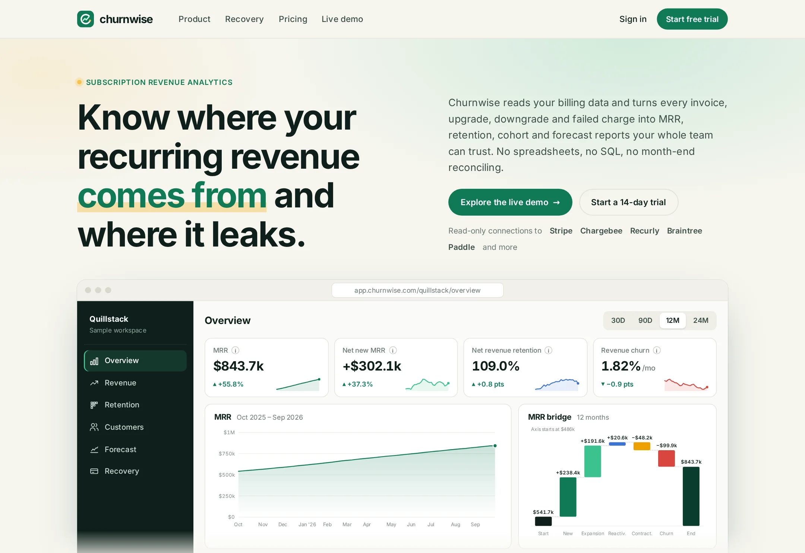

# Churnwise

Subscription revenue analytics for SaaS: MRR, retention, cohorts, forecasting and failed-payment recovery.

**Live demo:** https://www.freelancerportfoliohub.com/jameslee/projects/churnwise/index.html



## Overview

Churnwise connects read-only to a company's billing systems and rebuilds MRR history from raw billing events. Every
metric is derived from one daily model of five flows — new, expansion, reactivation, contraction and churn — so the
KPI tiles, the MRR bridge, the movement bars, the tables and the forecast always agree with each other.

This repository contains the marketing site (home, product, payment recovery, pricing), the interactive demo
dashboard for a sample workspace, the billing webhook that feeds the event store, and a small metrics API.

## Features

- **Six-tab dashboard** — Overview, Revenue, Retention, Customers, Forecast and Payment recovery, with 30D / 90D /
  12M / 24M ranges. Tabs are deep-linkable (`/demo#recovery`).
- **MRR bridge and movements** — a waterfall with connectors and diverging stacked movement bars with a net-new line.
- **Cohorts** — net MRR and logo retention heat maps on a sequential single-hue scale, with a cohort-average row.
- **Forecast** — conservative, base and stretch scenarios with an 80% interval that widens with the horizon.
- **Payment recovery** — outcomes funnel, recovered revenue by month, decline reasons and open failed payments;
  retries are scheduled per decline code (`lib/billing/retry-policy.ts`).
- **Billing webhook** — HMAC-signed, zod-validated, idempotent ingestion that turns subscription changes into MRR
  movements and tracks failed invoices through recovery.
- **Hand-rolled SVG charts** — no chart library; every chart has a legend or direct labels and hover values.

## Tech stack

- [Next.js 15](https://nextjs.org) (App Router) and React 19
- TypeScript (strict)
- PostgreSQL + [Prisma](https://www.prisma.io) for the event store
- [zod](https://zod.dev) for webhook and query validation
- [date-fns](https://date-fns.org) for calendar math
- Plain CSS (`app/globals.css`) with design tokens as custom properties

## Getting started

```bash
pnpm install
cp .env.example .env.local
pnpm db:migrate
pnpm dev
```

Open http://localhost:3000 for the site and http://localhost:3000/demo for the dashboard. The demo runs on the
built-in sample model and does not need a database; the webhook does.

### Environment variables

| Variable                 | Description                                          |
| ------------------------ | ---------------------------------------------------- |
| `DATABASE_URL`           | Postgres connection string for the event store       |
| `BILLING_WEBHOOK_SECRET` | Shared secret used to verify `x-churnwise-signature` |

### Sending a test webhook

```bash
BODY='{"id":"evt_1","workspace":"quillstack","source":"stripe","type":"subscription.created","occurredAt":"2026-09-24T12:00:00Z","data":{"subscriptionId":"sub_1","customerId":"cus_1","customerName":"Northgate Tutors","plan":"Growth","status":"active","currency":"USD","items":[{"priceId":"price_growth_annual","unitAmount":837600,"quantity":1,"interval":"year"}]}}'
T=$(date +%s)
SIG=$(printf '%s' "$T.$BODY" | openssl dgst -sha256 -hmac "$BILLING_WEBHOOK_SECRET" -hex | sed 's/^.* //')
curl -s localhost:3000/api/webhooks/billing -H "x-churnwise-signature: t=$T,v1=$SIG" -d "$BODY"
```

## Project structure

```
app/
  (marketing)/          home, product, recovery and pricing pages
  demo/                 interactive dashboard
  api/webhooks/billing/ signed billing-event ingestion
  api/metrics/          headline metrics and movements as JSON
components/
  charts/               AreaChart, MovementChart, Waterfall, ForecastChart, BarChart, HBarList, Sparkline, tooltip
  dashboard/            DashboardShell, AppNav, RangePicker, KpiTile, CohortGrid, DataTable, panels/
  marketing/            page sections (features, pricing, FAQ, recovery previews)
  site/                 header, footer, logo
  ui/                   icons, buttons, check lists
lib/
  billing/              webhook schema, signature check, ingestion, retry policy
  data/                 sample-workspace model, cohorts, plans, customers, site copy
  revenue.ts            MRR movements, NRR/GRR, churn, ranges, event → movement rules
  metrics.ts            KPI tiles, series and account trends for the dashboards
  forecast.ts           scenario forecasts and interval
  recovery.ts           failed-payment outcomes
  charts.ts             ticks, scales, paths, bridge and heat-map geometry
prisma/                 schema for the event store
types/                  shared types
```

## Scripts

| Script            | Description                            |
| ----------------- | -------------------------------------- |
| `pnpm dev`        | Start the dev server with Turbopack    |
| `pnpm build`      | Generate the Prisma client and build   |
| `pnpm start`      | Serve the production build             |
| `pnpm lint`       | Lint with the Next.js ESLint config    |
| `pnpm typecheck`  | Type-check with `tsc --noEmit`         |
| `pnpm db:migrate` | Create and apply database migrations   |
| `pnpm db:studio`  | Browse the database with Prisma Studio |
