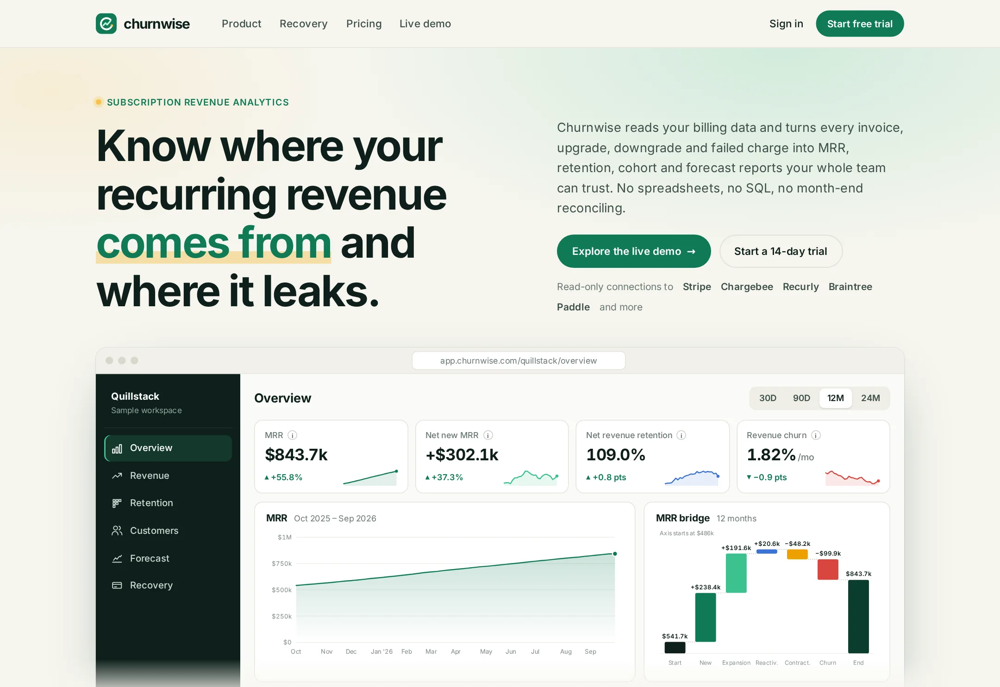

# Churnwise

Subscription revenue analytics for SaaS: MRR, retention, cohorts, forecasting and failed-payment recovery.

**Live demo:** https://www.freelancerportfoliohub.com/jameslee/projects/churnwise/index.html



## Overview

Churnwise connects read-only to a company's billing systems and rebuilds MRR history from raw billing events. Every
metric is derived from one daily model of five flows — new, expansion, reactivation, contraction and churn — so the
KPI tiles, the MRR bridge, the movement bars, the tables and the forecast always agree with each other.

The repository has two parts:

- **`engine/`** — a Python (FastAPI) service that owns all of the revenue math: MRR movements, NRR/GRR, cohort
  retention matrices, forecasts, churn survival curves, the failed-payment retry and dunning logic, the billing
  webhook and the event store.
- **The Next.js app** in the repository root — the marketing site (home, product, payment recovery, pricing) and the
  interactive demo dashboard for a sample workspace. Pages fetch their numbers from the engine on the server and
  only render them.

## Features

- **Six-tab dashboard** — Overview, Revenue, Retention, Customers, Forecast and Payment recovery, with 30D / 90D /
  12M / 24M ranges. Tabs are deep-linkable (`/demo#recovery`).
- **MRR bridge and movements** — a waterfall with connectors and diverging stacked movement bars with a net-new line.
- **Cohorts** — net MRR and logo retention heat maps on a sequential single-hue scale, with a cohort-average row.
- **Forecast** — conservative, base and stretch scenarios with an 80% interval that widens with the horizon, plus
  Holt's exponential smoothing and Kaplan–Meier survival curves (implemented by hand) behind
  `/api/forecast/smoothing` and `/api/forecast/churn`.
- **Payment recovery** — outcomes funnel, recovered revenue by month, decline reasons and open failed payments.
  Retries are scheduled per decline code, and `POST /api/recovery/plan` lays out the full dunning sequence for a
  failed charge (`engine/src/churnwise/domain/dunning.py`).
- **Billing webhook** — HMAC-signed, pydantic-validated, idempotent ingestion that turns subscription changes into
  MRR movements and tracks failed invoices through recovery.
- **Event-store analytics** — MRR, the monthly MRR bridge, trailing NRR/GRR and cohorts replayed from the movement
  ledger of any workspace that receives webhooks.
- **Hand-rolled SVG charts** — no chart library; every chart has a legend or direct labels and hover values.

## Tech stack

**Engine** (`engine/`)

- Python 3.12, [FastAPI](https://fastapi.tiangolo.com) and [pydantic v2](https://docs.pydantic.dev)
- [SQLAlchemy 2](https://www.sqlalchemy.org) with [Alembic](https://alembic.sqlalchemy.org) migrations; PostgreSQL
  in production, SQLite for local development and tests
- [uv](https://docs.astral.sh/uv/) for dependencies, [pytest](https://pytest.org) and [ruff](https://docs.astral.sh/ruff/)

**Web app**

- [Next.js 15](https://nextjs.org) (App Router) and React 19
- TypeScript (strict)
- Plain CSS (`app/globals.css`) with design tokens as custom properties

## Getting started

You need Python 3.12 with [uv](https://docs.astral.sh/uv/), and Node 22 with pnpm.

Start the engine (it listens on http://localhost:8000; interactive API docs at `/docs`):

```bash
cd engine
uv sync
export BILLING_WEBHOOK_SECRET=whsec_local  # only needed to send signed test webhooks
uv run churnwise bootstrap  # apply migrations and create the sample workspace
uv run churnwise serve --reload
```

The engine reads its settings from environment variables (listed below and in `engine/.env.example`); it does not
load a `.env` file. Without `DATABASE_URL` it stores events in a local SQLite file, `engine/churnwise.db`.

Then, in another terminal, start the web app:

```bash
pnpm install
cp .env.example .env.local
pnpm dev
```

Open http://localhost:3000 for the site and http://localhost:3000/demo for the dashboard. The demo runs on the
engine's built-in sample model, so it works before any webhook has been received.

### Environment variables

Web app:

| Variable  | Description                                                       |
| --------- | ----------------------------------------------------------------- |
| `API_URL` | Base URL of the engine, read on the server only (default `:8000`) |

Engine:

| Variable                 | Description                                                           |
| ------------------------ | --------------------------------------------------------------------- |
| `DATABASE_URL`           | Event store. `postgres://` URLs are accepted; defaults to SQLite      |
| `BILLING_WEBHOOK_SECRET` | Shared secret used to verify `x-churnwise-signature`                  |
| `API_TOKEN`              | Bearer token for `/api/workspaces/*`; leave unset only for local work |
| `CORS_ORIGINS`           | Comma-separated origins allowed to call the API from a browser        |
| `PORT`                   | Port for `churnwise serve` (default `8000`)                           |

### Sending a test webhook

```bash
BODY='{"id":"evt_1","workspace":"quillstack","source":"stripe","type":"subscription.created","occurredAt":"2026-09-24T12:00:00Z","data":{"subscriptionId":"sub_1","customerId":"cus_1","customerName":"Northgate Tutors","plan":"Growth","status":"active","currency":"USD","items":[{"priceId":"price_growth_annual","unitAmount":837600,"quantity":1,"interval":"year"}]}}'
T=$(date +%s)
SIG=$(printf '%s' "$T.$BODY" | openssl dgst -sha256 -hmac "$BILLING_WEBHOOK_SECRET" -hex | sed 's/^.* //')
curl -s localhost:8000/api/webhooks/billing -H "x-churnwise-signature: t=$T,v1=$SIG" -d "$BODY"
```

The response says whether the event was processed or a duplicate, and which MRR movement it produced (here a
`new` movement of $698, the annual price spread over twelve months).

## Engine API

| Method & path                                                        | Returns                                                          |
| -------------------------------------------------------------------- | ---------------------------------------------------------------- |
| `GET /api/dashboard`                                                 | Every dashboard tab for every range and scenario, in one call    |
| `GET /api/metrics?range=12m&movements=true`                          | Headline metrics, the MRR line and optional per-period movements |
| `GET /api/ranges/{range}`                                            | KPI tiles, MRR line, bridge and movement buckets for one range   |
| `GET /api/retention`, `GET /api/cohorts`                             | NRR/GRR series, retention KPIs and the cohort heat map           |
| `GET /api/customers`, `/api/accounts`, `/api/plans`, `/api/activity` | Customer tab data                                                |
| `GET /api/forecast`, `/api/forecast/scenarios/{scenario}`            | Scenario forecasts with intervals and monthly tables             |
| `GET /api/forecast/smoothing`                                        | Holt's linear-trend forecast of MRR with a holdout backtest      |
| `GET /api/forecast/churn`                                            | Kaplan–Meier survival, fitted hazard and projected churn         |
| `GET /api/recovery`, `POST /api/recovery/plan`                       | Recovery reporting; the dunning plan for a failed charge         |
| `POST /api/webhooks/billing`                                         | Signed billing-event ingestion                                   |
| `GET /api/workspaces/{slug}/summary`                                 | MRR, monthly bridge, trailing NRR/GRR and cohorts from the store |
| `GET /api/workspaces/{slug}/movements`                               | The MRR movement ledger                                          |
| `GET /api/workspaces/{slug}/failed-payments`                         | Failed payments with recovery totals by decline code             |
| `GET /health`, `GET /health/ready`                                   | Liveness and database readiness                                  |

## Project structure

```
app/
  (marketing)/          home, product, recovery and pricing pages
  demo/                 interactive dashboard
components/
  charts/               AreaChart, MovementChart, Waterfall, ForecastChart, BarChart, HBarList, Sparkline, tooltip
  dashboard/            DashboardShell, AppNav, RangePicker, KpiTile, CohortGrid, DataTable, panels/
  marketing/            page sections (features, pricing, FAQ, recovery previews)
  site/                 header, footer, logo
  ui/                   icons, buttons, check lists
lib/
  api.ts                server-side client for the engine (API_URL)
  charts.ts             ticks, scales, paths, bridge and heat-map geometry
  data/                 marketing copy (home, product, pricing, recovery, site)
  format.ts, palette.ts number formatting and colours
types/                  shapes returned by the engine
engine/
  src/churnwise/
    domain/             revenue model, movements, NRR/GRR, cohorts, metrics, forecast, smoothing,
                        survival, recovery, dunning, ledger analytics
    billing/            webhook schema, signature check, ingestion
    db/                 SQLAlchemy models, repository queries, Alembic migrations
    api/                FastAPI routes, response schemas and views
    fixtures/           sample-workspace seed data (accounts, plans, activity, failed payments)
  tests/                pytest suite, including parity checks against the original TypeScript numbers
  Dockerfile            container image for the engine
```

## Scripts

| Script             | Description                         |
| ------------------ | ----------------------------------- |
| `pnpm dev`         | Start the web app with Turbopack    |
| `pnpm build`       | Build the web app                   |
| `pnpm start`       | Serve the production build          |
| `pnpm lint`        | Lint with the Next.js ESLint config |
| `pnpm typecheck`   | Type-check with `tsc --noEmit`      |
| `pnpm engine:dev`  | Start the engine with auto-reload   |
| `pnpm engine:test` | Run the engine's test suite         |

Inside `engine/`:

| Command                                           | Description                                  |
| ------------------------------------------------- | -------------------------------------------- |
| `uv run pytest`                                   | Run the tests                                |
| `uv run ruff check src tests`                     | Lint                                         |
| `uv run churnwise migrate`                        | Apply database migrations                    |
| `uv run churnwise create-workspace <slug> <name>` | Create a workspace that can receive webhooks |
| `uv run churnwise serve`                          | Run the API server                           |

## Deploying on Railway

Create two services from this repository:

1. **engine** — set the root directory to `engine`. It builds from `engine/Dockerfile` (see `engine/railway.json`),
   runs migrations on start and listens on `$PORT`. Add a PostgreSQL database and set `DATABASE_URL`,
   `BILLING_WEBHOOK_SECRET`, `API_TOKEN` and `PORT=8000`.
2. **web** — the repository root, built with the default Node builder (`pnpm build`, `pnpm start`). Set `API_URL` to
   the engine's private URL: `http://${{engine.RAILWAY_PRIVATE_DOMAIN}}:8000`.
